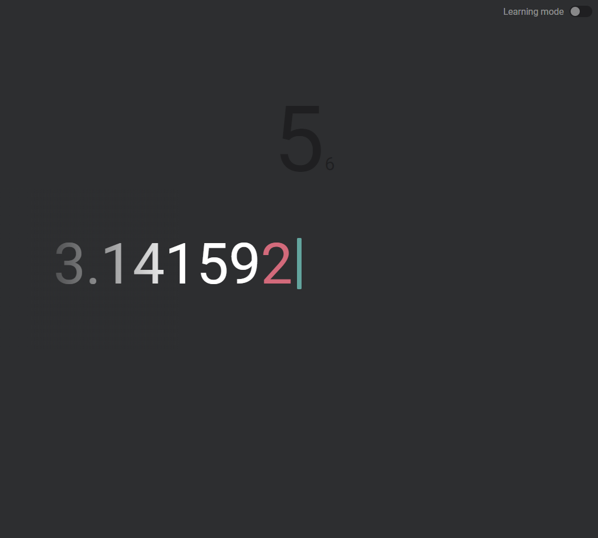

# A website to help with learning the digits of pi inspired by Monkeytype

Play it [HERE](https://pi.artomweb.com)

- Type the digits of pi
- Press ENTER to try again
- Learning mode shows you the next digit after a timeout

## TODO:

- Hide caret after incorrect entry
- Show list of key bindings at bottom when not typing
- In learning mode, after an incorrect entry, make the digit on the right side of the caret go red so the user practices typing it
- Prevent score being added if the user changes from learning mode to normal at the end of an attempt
